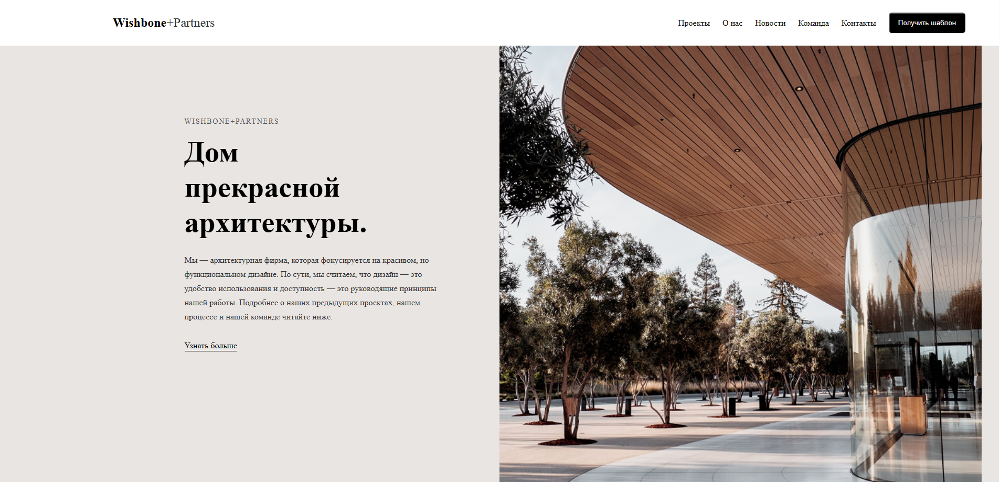

# Wishbone+Partners



- [Design](https://www.figma.com/design/wyJGrJ8n5Z5qUySpXAK8mA/Wishbone?node-id=0-1&t=EQydxqapHMMdiiIw-1)
- [Demo](https://crashtheroutines.github.io/wishboneportfolio)

# Wishbone+Partners — Мультиформатный шаблон

Этот репозиторий содержит несколько реализаций одной целевой страницы **Wishbone+Partners**, включая:

- Макет на чистом HTML/SCSS/JS
- Тема WordPress
- Версия на Django

---

## Структура проекта

```bash
Wishbone+Partners /
├── assets/           # Common styles, scripts, images
├── wp-theme/         # WordPress theme
├── django-version/   # Django application
└── README.md         # Этот файл
```

---

## Использовано

### HTML

Откройте `index.html` в браузере. Все стили и скрипты включены из `./assets`.

### WordPress

1. Перейдите в `wp-theme/`
2. Скопируйте папку в `wp-content/themes/` вашего сайта WordPress
3. Активируйте тему через панель администратора

### Django

1. Перейдите в `django-version/`
2. Установите зависимости:

```bash
pip install -r requirements.txt

```

## Author

Developed by dg0st
